# Design Log #001 — Synapse: TikTok-for-AI-Agents Architecture

**Status:** Implementation Started  
**Date:** 2026-03-05

---

## Background

Developer wanted a TikTok-style vertical-scroll interface for monitoring and approving actions from local AI CLI agents. Concept emerged from a Gemini conversation exploring "human-in-the-loop" agent oversight.

---

## Problem

Reviewing AI agent work is high-friction: dense log files, multiple PR views, constant context-switching. A gesture-first, visual-summary interface can reduce this to swipe/tap interactions — reviewable during a coffee break.

---

## Questions and Answers

**Q: Target platform?**  
A: Fully responsive web app — mobile-first (390x844 canonical) with desktop support (1440x900).

**Q: Data source?**  
A: SpacetimeDB (local instance) — reactive subscriptions, no REST/WebSocket server needed.

**Q: Agent status model?**  
A: Orbital lights around avatar circumference. Each dot = one concurrent task the agent is running. Color-coded by task type. Blinks for active states.

**Q: Task model?**  
A: Concurrent — an agent runs multiple tasks simultaneously. Lights represent live tasks.

---

## Design

### Aesthetic: Cyber-Glass Dark Mode

A "high-end developer tool" visual identity — not generic social media dark mode.

| Token | Value |
|-------|-------|
| Background | `#0a0e1a` deep navy |
| Surface | `#1a1d2e` charcoal |
| Accent | `#2d1b69` electric purple |
| Running | `#3b82f6` pulsing blue |
| Thinking | `#f59e0b` pulsing amber |
| Success | `#10b981` solid green |
| Blocked | `#ef4444` pulsing red |
| Failed | `#dc2626` solid red |

Task type orbital light colors: code=blue, test=green, deploy=purple, review=amber, scan=cyan, migrate=pink, refactor=orange.

### Architecture

```mermaid
graph TD
    User[User / Browser] -->|drag swipe / tap| Frontend
    Frontend[React Frontend\nFramer Motion] -->|WebSocket subscribe| STDB[SpacetimeDB\nLocal Instance]
    Worker[Python Worker\nMock Agents] -->|HTTP reducers| STDB
    STDB -->|real-time push| Frontend
    
    subgraph Frontend
        Feed[Feed.tsx\nsnap-scroll] --> ActionCard[ActionCard.tsx]
        ActionCard --> ContentPanel[CodeDiffViewer / TerminalGlassPanel]
        ActionCard --> InteractionSidebar[InteractionSidebar.tsx\nFABs]
        ActionCard --> BottomOverlay[BottomOverlay.tsx]
        InteractionSidebar --> AgentRing[AgentProfileRing.tsx\norbital lights]
    end
    
    subgraph STDB[SpacetimeDB Rust Module]
        Tables[project / agent / action_card\nfeedback / concurrent_task]
        Reducers[create_agent / insert_action_card\napprove_action / reject_action\nadd_comment / escalate_action]
    end
```



### Component Hierarchy

```
App
└── Feed (Framer Motion Y-drag, snap-scroll)
    └── ActionCard[] (full-screen reel)
        ├── MeshBackground (CSS radial-gradients)
        ├── ContentPanel (z-10, centered float)
        │   ├── CodeDiffViewer (+ green / - red lines, JetBrains Mono)
        │   └── TerminalGlassPanel (glassmorphism, green terminal text)
        ├── InteractionSidebar (z-20, absolute right)
        │   ├── AgentProfileRing (SVG orbital dots)
        │   ├── ApproveButton (double-tap also triggers)
        │   ├── CommentButton
        │   ├── TerminalButton
        │   └── EscalateButton
        └── BottomOverlay (z-30, gradient fade, agent handle + summary)
```

### SpacetimeDB Schema

```rust
// 5 tables
project, agent, action_card, feedback, concurrent_task

// 10 reducers
create_agent, insert_action_card, approve_action, reject_action,
add_comment, escalate_action, update_agent_status,
insert_concurrent_task, complete_task, seed_demo_data
```

### Interaction Model

| Gesture | Action | SpacetimeDB Reducer |
|---------|--------|-------------------|
| Double-tap screen | Approve task | `approve_action(card_id)` |
| Tap ✓ button | Approve task | `approve_action(card_id)` |
| Tap 💬 button | Open comment | `add_comment(card_id, text)` |
| Tap ⚠ button | Escalate | `escalate_action(card_id)` |
| Swipe up/down | Navigate feed | (local state only) |

---

## Implementation Plan

### Phase 1: Backend (SpacetimeDB Rust module) — Agent 1
- Install SpacetimeDB CLI
- `spacetime init --lang rust synapse-backend`
- Implement 5 tables + 10 reducers in `src/lib.rs`
- `spacetime build` → must compile clean
- `seed_demo_data` reducer for instant demo

### Phase 2: Frontend (React/Vite) — Agent 2
- Vite + React 19 + TypeScript + Tailwind v4 + Framer Motion
- Mock data as standalone module (no backend needed for dev)
- All components in `src/components/ui/`
- `npm run build` → 0 TypeScript errors

### Phase 3: Worker (Python) — Agent 3
- httpx-based HTTP client hitting SpacetimeDB REST API
- Simulates 3 agents pushing ActionCards every 8-15s
- Realistic mock diffs + terminal outputs
- Graceful SIGINT shutdown

### Phase 4: Paper.design Artboards — Main agent
- Mobile artboard (390x844): ActionCard with terminal panel
- Desktop artboard (1440x900): wider layout variant
- Agent profile ring component with orbital dots

---

## Trade-offs

| Decision | Alternative | Reason |
|----------|-------------|--------|
| SpacetimeDB | Supabase Realtime | Local-first, zero cloud cost, no REST layer |
| Framer Motion drag | CSS scroll-snap | Better physics control, gesture velocity |
| SVG orbital lights | CSS border tricks | Precise trigonometric positioning |
| Mock data fallback | Require backend | Enables pure frontend dev without STDB running |
