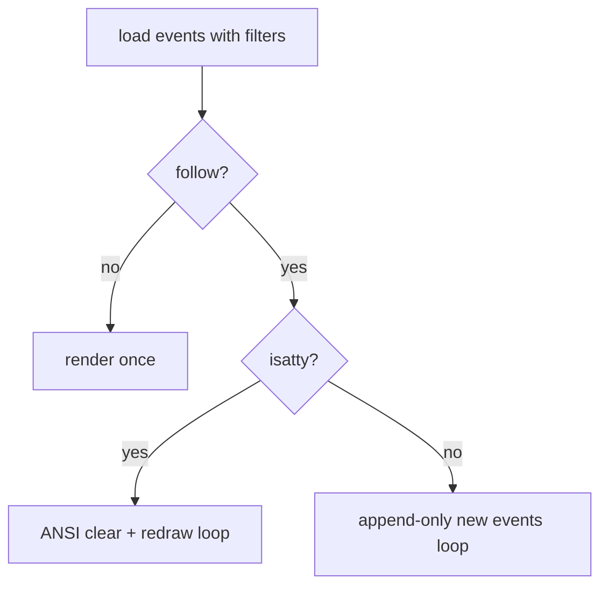

## Background

`acs log` currently prints plain lines and `--follow` appends new events once per second.

## Problem

The CLI needs higher signal in active debugging sessions:
- colorized event types
- worker identity readability
- follow output that refreshes in-place (top-like)
- filter composition (`worker`, `ticket`)
- elapsed time per event

## Questions and Answers

1. Should follow-mode ANSI redraw run for non-TTY output?
   - Answer: No. Non-TTY output should remain append-only/plain for piping and logs.
2. Should existing `--worker` remain supported?
   - Answer: Yes, for backward compatibility. It is merged with `--filter worker=...`.

## Design

- Extend command arguments:
  - Keep `--worker`
  - Add repeatable `--filter key=value`
- Parse filters into:
  - `worker: Option<String>`
  - `ticket: Option<String>`
- Query DB with optional worker and ticket constraints.
- Render each event as:
  - timestamp
  - elapsed age (e.g., `3m ago`)
  - colored worker badge
  - colorized event type
  - detail + token suffix
- Follow behavior:
  - TTY: clear + home ANSI redraw each tick using latest events
  - non-TTY: append-only incremental output
- Color mapping:
  - completed = green
  - error = red
  - assigned = yellow
  - merged = blue

## Implementation Plan

1. Add `colored` dependency.
2. Extend clap command args + `main` dispatch call.
3. Add DB API for combined event filters.
4. Refactor `cli/log.rs` with rendering/filter parsing helpers.
5. Add unit tests for filter parsing and elapsed formatting.

## Examples

- ✅ `acs log --filter worker=w-0 --filter ticket=t-001 --follow`
- ✅ `acs log --worker w-0 --filter ticket=t-001`
- ❌ `acs log --filter worker` (missing `=`)
- ❌ `acs log --filter foo=bar` (unsupported key)

## Trade-offs

- Full-screen redraw is simpler than diff-based line updates, but can flicker on slower terminals.
- Keeping `--worker` + `--filter worker` increases argument surface, but avoids breaking existing scripts.
