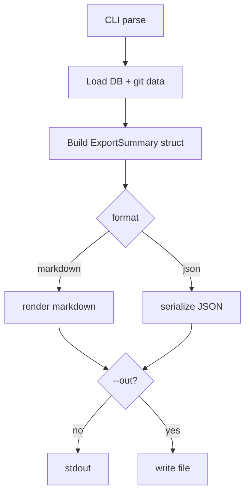

## Background

`acs report` provides a markdown snapshot, but there is no command that exports a handoff-oriented summary in either markdown or JSON.

## Problem

Teams need a portable project summary for status handoffs and progress reporting, including tickets, merge history, KB organization, token/cost usage, and ADRs.

## Questions and Answers

1. What should represent "completion time" for a ticket?
   - Answer: Use `updated_at` when `status == "completed"`, otherwise `null`/`-`.
2. How should merged branches be collected?
   - Answer: Use `git log --merges` and parse merge commit subject + timestamp.
3. Should output default to stdout or file?
   - Answer: Default stdout; optional `--out` writes to file while keeping normal command success semantics.

## Design

- Add new command:
  - `acs export [--format markdown|json] [--out <path>]`
- Gather export data from:
  - DB tickets (`list_tickets`)
  - DB KB entries (`list_all_knowledge`)
  - DB token totals (`total_token_details`)
  - Git merge log (`git log --merges`)
- Build a single `ExportSummary` model with:
  - tickets (status, assignee, completion_time)
  - merged_branches (timestamp, hash, subject)
  - knowledge_by_domain
  - token_usage (input/output/total + sonnet/opus estimates)
  - adrs (KB entries where key starts with `adr` or `decision`)
- Renderers:
  - markdown renderer for handoff docs
  - JSON renderer for automation

## Implementation Plan

1. Add `Export` variant to clap command enum and main dispatch.
2. Add `src/cli/export.rs` with data model, collector, and markdown/json renderers.
3. Reuse pricing constants for cost estimates.
4. Add unit tests for markdown/json structure and grouping behavior.
5. Validate with targeted tests and full `cargo test`.

## Examples

- ✅ `acs export`
- ✅ `acs export --format json`
- ✅ `acs export --format markdown --out .acs/reports/handoff.md`

## Trade-offs

- Git merge parsing from commit subject is lightweight but depends on merge message style.
- ADR detection via key prefix is simple and backwards compatible, but may miss non-standard ADR keys.

## Implementation Results

- Implemented `acs export` with `--format markdown|json` and optional `--out`.
- Added `src/cli/export.rs` with:
  - unified summary collection from DB + git
  - markdown renderer and JSON serialization output
  - token usage + Sonnet/Opus cost estimation
  - ADR extraction from KB (`adr*`/`decision*`)
- Wired clap command and dispatch in `src/cli/mod.rs` and `src/main.rs`.
- Added unit tests for merge-subject branch parsing and required markdown sections.
- Validation:
  - `cargo test` passed (156 unit + integration suite)
  - `cargo run -- export --format markdown` and `--format json` smoke-tested successfully.

### Deviations from Initial Design

- `merged_branches` keeps both raw merge commit subject and optional parsed branch name instead of only parsed branch labels, to preserve data fidelity when merge subjects are non-standard.
