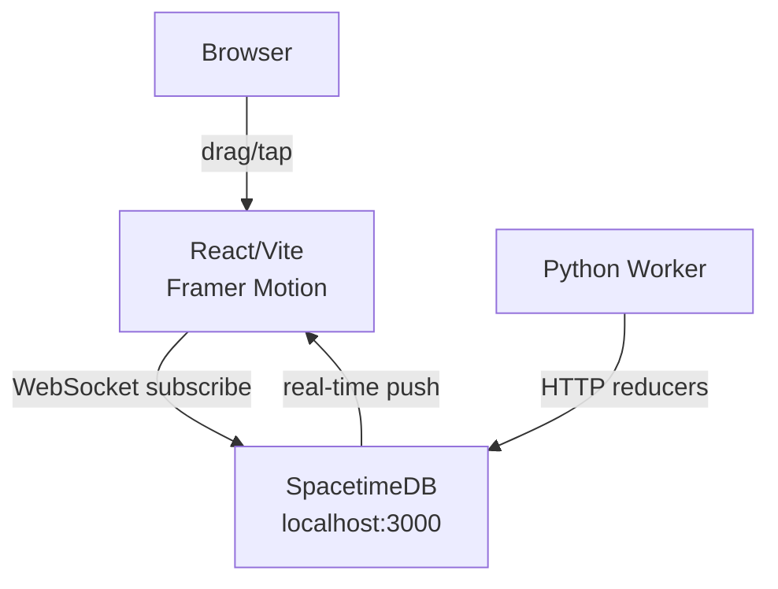

# Synapse — Design Document
**Date:** 2026-03-05 | **Status:** Implementation Complete

## Summary
TikTok-style vertical snap-scroll feed for monitoring and approving local AI agent tasks. Swipe through ActionCards (agent "reels"), double-tap to approve, comment to redirect, escalate to human.

## Architecture



## Tech Decisions

| Layer | Choice | Rationale |
|-------|--------|-----------|
| Database | SpacetimeDB (Rust module) | Local-first, zero REST layer, reactive push |
| Frontend | React 19 + Vite + Tailwind v4 | Fast iteration, Tailwind v4 CSS-first config |
| Scroll | Framer Motion drag | Velocity-aware physics vs CSS scroll-snap |
| Worker | Python + httpx | Minimal; calls SpacetimeDB REST API directly |

## SpacetimeDB Schema

**Tables:** `project`, `agent`, `action_card`, `feedback`, `concurrent_task`

**Reducers:** `create_agent`, `insert_action_card`, `approve_action`, `reject_action`, `add_comment`, `escalate_action`, `update_agent_status`, `insert_concurrent_task`, `complete_task`, `seed_demo_data`

`action_card.status` values: `running | thinking | success | blocked | failed | queued | cancelled`

## Component Tree

```
App
└── Feed (Framer Motion Y-drag, spring stiffness=300 damping=30)
    └── ActionCard[] (h-screen, full-viewport reel)
        ├── MeshBackground  (radial-gradient: #0a0e1a + #1a1d2e + #2d1b69)
        ├── ContentPanel    (absolute, left 5%, right 80px, top 15%, bottom 220px)
        │   ├── CodeDiffViewer    (+ green / - red, JetBrains Mono 12px)
        │   └── TerminalGlassPanel (backdrop-blur 20px, rgba(26,29,46,0.7))
        ├── InteractionSidebar (absolute right-4, vertically centered)
        │   ├── AgentProfileRing  (SVG: orbital dots at r·cos/sin(θ), status ring)
        │   ├── ApproveButton     (#10b981 green, double-tap also triggers)
        │   ├── CommentButton     (#f59e0b amber)
        │   ├── TerminalButton    (#06b6d4 cyan)
        │   └── EscalateButton    (#ef4444 red)
        └── BottomOverlay    (gradient-to-top from black, agent handle + summary)
```

## Visual Design System

**Palette:** `#0a0e1a` bg · `#1a1d2e` surface · `#2d1b69` purple accent

**Status colors:** running=`#3b82f6` · thinking=`#f59e0b` · success=`#10b981` · blocked=`#ef4444` · failed=`#dc2626` · queued=`#6b7280`

**Task orbital dot colors:** code=blue · test=green · deploy=purple · review=amber · scan=cyan · migrate=pink · refactor=orange

**AgentProfileRing:** SVG circle + text initials. Orbital dots at `(cx + r·cos(2πi/n - π/2), cy + r·sin(...))` where r = avatarRadius + 10. Active dots use CSS `@keyframes orbital-blink`. Status ring uses `stroke-dasharray` pulse for active states.

## Interaction Model

| Gesture | Action | Reducer |
|---------|--------|---------|
| Double-tap | Approve | `approve_action(card_id)` |
| ✓ button | Approve | `approve_action(card_id)` |
| 💬 button | Comment | `add_comment(card_id, text)` |
| ⚠ button | Escalate | `escalate_action(card_id)` |
| Swipe up/↓ key | Next card | local state |
| Swipe down/↑ key | Prev card | local state |

## Trade-offs

| Decision | Alternative | Reason chosen |
|----------|-------------|---------------|
| SpacetimeDB | Supabase Realtime | Local, zero cloud, no REST boilerplate |
| Framer Motion | CSS scroll-snap | Velocity physics, programmatic control |
| SVG orbital lights | CSS border tricks | Precise trig positioning |
| Mock data fallback | Require backend | Pure frontend dev without STDB running |
| Python httpx worker | Node.js | Minimal deps, clean async, no build step |

## Running Locally
```bash
./start.sh   # starts SpacetimeDB + worker + frontend
# or manually:
spacetime start
cd backend/synapse-backend && spacetime publish synapse-backend-g9cee --server local
cd worker && python3 main.py &
cd frontend && npm run dev
```
